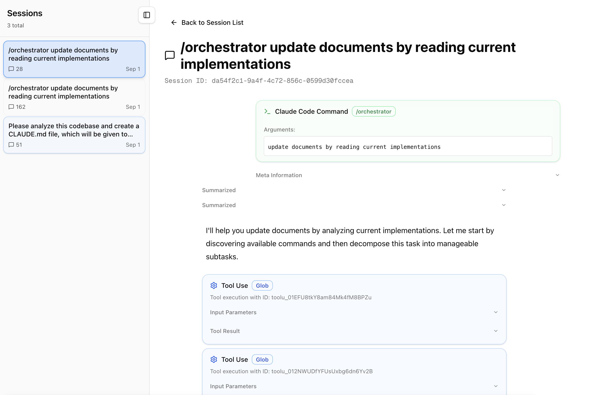
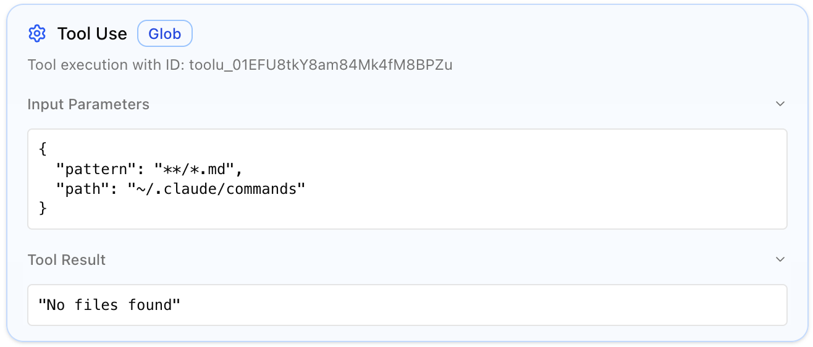
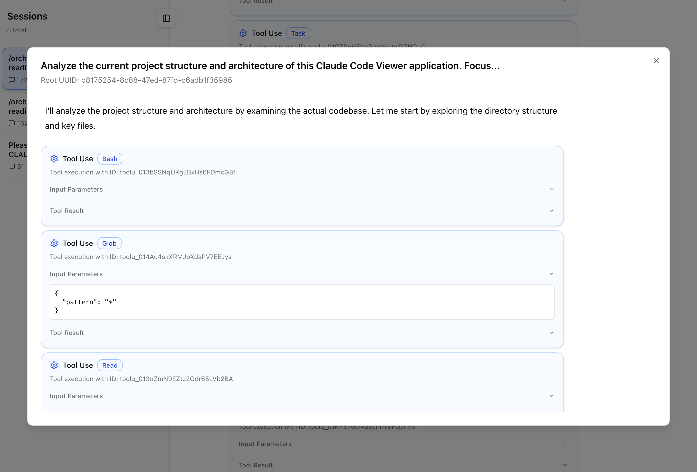

# Claude Code Viewer

A web-based viewer for browsing Claude Code conversation history files. View and navigate your Claude Code project conversations through a clean, intuitive interface.

## Overview

Claude Code Viewer parses JSONL conversation files stored in `~/.claude/projects/` and presents them in a human-readable web UI. Browse projects, sessions, and detailed conversation history with support for tool usage, subtasks, and real-time file monitoring.



## Features

- **Project Browser** - View all Claude Code projects with metadata and session counts
- **Session Navigation** - Browse conversation sessions within projects with filtering options  
- **Conversation Display** - Human-readable format for Claude Code logs with syntax highlighting
- **Command Detection** - Parses XML-like command structures for enhanced display
- **Real-time Updates** - Server-Sent Events provide live updates when files change
- **Tool Usage Display** - Clear presentation of tool calls, parameters, and results
  - 
- **Sub Task Display**
  - 

## Installation & Usage

### Quick Start (CLI)

Run directly from npm without installation:

```bash
PORT=3400 npx @kimuson/claude-code-viewer@latest
```

Alternatively, install globally:

```bash
npm install -g @kimuson/claude-code-viewer
claude-code-viewer
```

The application uses pnpm as the package manager (v10.8.1) and is published as version 0.0.5.

The server will start on port 3400 (or the specified PORT). Open `http://localhost:3400` in your browser.

### Alternative Installation

Clone and run locally:

```bash
git clone https://github.com/d-kimuson/claude-code-viewer.git
cd claude-code-viewer
pnpm i
pnpm build
pnpm start
```

## Requirements

- **Node.js** 18 or later
- **Claude Code** with conversation history in `~/.claude/projects/`

## Data Source

The application reads Claude Code conversation files from:

- **Location**: `~/.claude/projects/<project>/<session-id>.jsonl`
- **Format**: JSONL files containing conversation entries
- **Auto-detection**: Automatically discovers new projects and sessions

## Usage Guide

### 1. Project List

- Browse all Claude Code projects
- View project metadata (name, path, session count, last modified)
- Click any project to view its sessions

### 2. Session Browser  

- View all conversation sessions within a project
- Filter to hide empty sessions
- Sessions show message counts and timestamps
- Click to view detailed conversation

### 3. Conversation Viewer

- Full conversation history with proper formatting
- Syntax highlighting for code blocks
- Tool usage and results clearly displayed
- Navigation sidebar for jumping between sessions
- Support for different message types (user, assistant, system, tools)

## Configuration

### Port Configuration

Set a custom port using the `PORT` environment variable:

```bash
PORT=8080 npx @kimuson/claude-code-viewer@latest
```

### Data Directory

The application automatically detects the standard Claude Code directory at `~/.claude/projects/`. No additional configuration is required.

## License

This project is available under the MIT License.

## Contributing

See [docs/dev.md](docs/dev.md) for detailed development setup and contribution guidelines.
